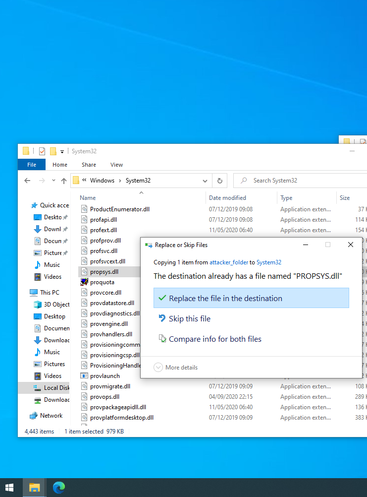
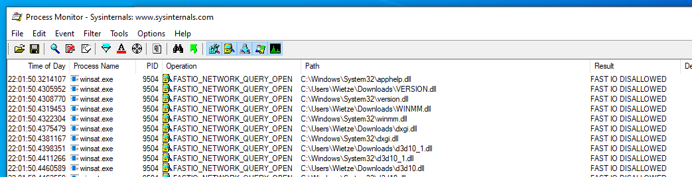

# Hello, who dis?

### Wietze Beukema

* Threat Hunting
* Detection Engineering & Research
* PwC UK, London

  
Keep in touch:

 [\@Wietze](https://www.twitter.com/wietze)

 [github.com/wietze](https://github.com/wietze)

 [wietze.beukema@pwc.com](mailto:wietze.beukema@pwc.com)

# 👾 DLL Hijacking

# What's in a name?

{.full-width-title}

# DLL Hijacking

"Tricking a legitimate/trusted application into loading an arbitrary DLL"

# DLL Hijacking (2)
- **T1574** : Hijack Execution Flow
  - **T1574.001**: DLL Search Order Hijacking
  - **T1574.002**: DLL Side-Loading

  
But why?

- Your evil code, executed by a trusted executable
- Great for Execution, Persistence, Privilege Escalation
- The threat is real

# Types{.emphasis}
## A few common ones

|Type | Method |
|---- | ----------- |
|1: **DLL replacement** | Replace a legitimate DLL with the evil DLL. |
|2: **DLL search order hijacking** | Place the evil DLL in a location that is ched for before the legitimate DLL. |
|3: **Phantom DLL Hijacking** | Drop the evil DLL in place of a missing/existing DLL that a legitimate application tries to load. |
|4: **DLL redirection** | Change the location in which the DLL is searched for, by editing the %PATH% environment variable or .exe.manifest / .exe.local. |
|5: **WinSxS DLL replacement** (_'DLL side-loading'_)| Replace the legitimate with the evil DLL in the relevant WinSxS folder of the targeted DLL. |
|6: **Relative path DLL Hijacking** | Copy (and optionally rename) the legitimate application to a user-writeable folder, alongside the evil DLL. |

# Types
## 1: DLL replacement

> "Replace a legitimate DLL with the evil DLL."

* Most basic type
* Could run DLL with high integrity (although replacement usually requires this too)

### Example{.emphasis}

Copy `evil.dll` to `c:\windows\system32\propsys.dll`, replacing the existing DLL. Now run `c:\windows\system32\netplwiz.exe`. _Execution_!

{.split}

# Types
## 2: DLL search order hijacking

> "Place the evil DLL in a location that is searched for before the legitimate DLL."

* Look at the _DLL search order_: (1) Directory of application → (2) System32 directory → (3) System directory → (4) Windows directory → (5) Current directory → (6) `%PATH%`
* CVE potential: especially executables running with high integrity
* Good way to find these: look for `FILE NOT FOUND` in Procmon

### Example{.emphasis}
Vault7 Leaks: portable Chrome tries to load `DWrite.dll`, located in `System32\`. Because no absolute path is specified, the directory of the application is tried first [[1]]. _Execution_ + _Persistence_!

# Types
## 3: Phantom DLL Hijacking

> "Drop the evil DLL in place of a missing/non-existing DLL that a legitimate application tries to load."

* More rare, yet not uncommon
* Less likely your DLL will break the running application
* CVE potential

### Example{.emphasis}

Vault7 leaks: Kaspersky process `avp.exe` intended to load `WHEAPGRD.DLL`. Due to a bug, it would prepend the drive letter, meaning it would try to load non-existing file `CWHEAPGRD.DLL` [[2]]. _Execution_ + _Persistence_!

# Types
## 4: DLL redirection
> "Change the location in which the DLL is searched for, by editing %PATH% or .exe.manifest / .exe.local."

# Types
## 5: WinSxS DLL replacement
> "Replace the legitimate with the evil DLL in the relevant WinSxS folder of the targeted DLL."

* Sometimes referred to as 'DLL Side-Loading'

# Types
## 6: Relative path DLL Hijacking
> "Copy (and optionally rename) the legitimate application to a user-writeable folder, alongside the evil DLL."

::: incremental
* Simple: DLL Hijacking with least preconditions
* No CVE/LOLbin potential, yet very powerful
* Combine with other techniques for more impact, e.g. UAC bypass

### Example{.emphasis}
Ocean Lotus/APT32 embedded the legitimate `system32\` executable `rekeywiz.exe` alongside an evil `duser.dll` in one of their phishing documents. After unpacking, the trusted `rekeywiz.exe` would load the malicious `duser.dll` which would start phase 2 of the attack [[3], [4]].  _Execution_!

{.split}
:::

# Types
## 6: Relative path DLL Hijacking (2)
> "Copy (and optionally rename) the legitimate application to a user-writeable folder, alongside the evil DLL."

* Nearly 300 (!) `system32\` executables are vulnerable to this [[5]]

* Many, many more outside this dir, as well as non-Microsoft (see Hexacorn et al.)

* Can be combined with UAC bypass techniques

{.center}

# Types
## 6: Relative path DLL Hijacking (3)
> "Copy (and optionally rename) the legitimate application to a user-writeable folder, alongside the evil DLL."

This poses a problem:

  * Relies on legitimate executables
  * Many possible candidates
  * Actively used in the wild
  * Impact is medium to high

So how to prevent / detect this?

{.split}

# 🧭 Prevention & Detection

# Preventing DLL Hijacking

+---------------------------------+---------------------------+
|**🔧 Developers**                 | **👩‍💻 👨‍💻 System admins**|
+=================================+=================================+
|  Use absolute DLL paths         |  Use  |
|   where possible           |   `PreferSystem32Images` |
|      _e.g. `system32\`          |  and `MicrosoftSignedOnly`|
|     DLLs, environment           |   /`StoreSignedOnly` |
|     variables if needed_        |   process mitigations? |
|                                 | [[6]] |
+---------------------------------+------+
|  Verify validity of DLL    |  |
|     _i.e. check expected        | |
|     signature_                  | |
+--+--+

  

### Nevertheless: the problem remains!{.emphasis}

# Detecting DLL Hijacking
## It's not straightforward...

A few (flawed) ideas:

- Look for known DLL hijack targets (DLL names, executables) [[7]]
- Look for creation of DLLs by unexpected processes
- Look for common targets (e.g. Microsoft-signed executables) in unexpected locations
- Look for common targets loading DLLs not on VT
- ...

{.split}

# Detecting DLL Hijacking (2)
* 🔎 Instead of just looking for the DLL Injection, look for the **behaviour that follows**

* 📚 **Layer your defences**!

* 🛡️ Ensure a **broad base** of behavioural rules, hunting techniques, anomaly detection

[1]: https://wikileaks.org/ciav7p1/cms/page_27492385.html
[2]: https://wikileaks.org/ciav7p1/cms/page_3375327.html
[3]: https://twitter.com/0xCARNAGE/status/1203882560176218113
[4]: https://any.run/report/f08ccc040c8d8db60f30a6d1026aa6523e97c6cf52b1b30f083a830a0a65a3a9/3abfc241-3ab0-4016-acbb-040b44199d52
[5]: https://wietze.github.io/blog/hijacking-dlls-in-windows
[6]: https://docs.microsoft.com/en-us/windows/win32/api/processthreadsapi/nf-processthreadsapi-updateprocthreadattribute
[7]: https://github.com/wietze/windows-dll-hijacking/blob/master/possible_windows_dll_hijacking.yml
